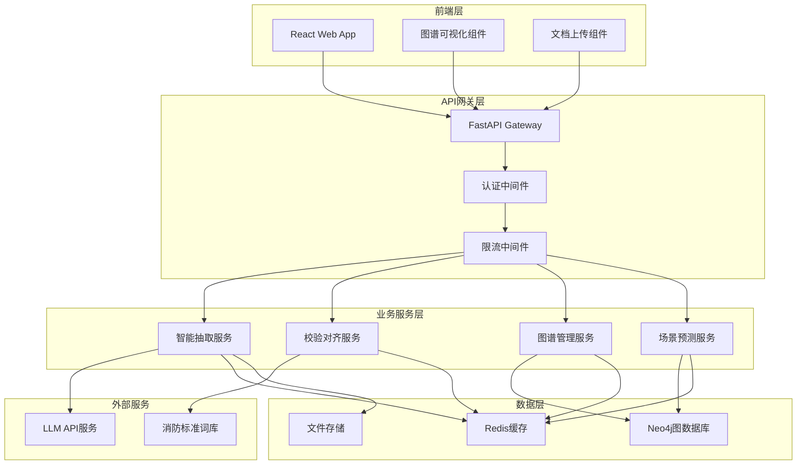

# 火瞳系统设计文档

## 概述

火瞳系统是一个基于微服务架构的火灾事理图谱Web系统，采用Python FastAPI作为后端框架，React (Next.js)作为前端框架，Neo4j作为图数据库。系统通过智能抽取层、校验对齐层、图谱存储层和场景预测模块，实现从火灾调查报告到可视化预测的完整工作流。

## 架构

### 系统架构图



### 技术栈

- **前端**: React 18 + Next.js 14 + Tailwind CSS + TypeScript
- **后端**: Python 3.11 + FastAPI + Pydantic + SQLAlchemy
- **数据库**: Neo4j 5.x + Redis 7.x
- **可视化**: ECharts + react-force-graph
- **部署**: Docker + Docker Compose
- **监控**: Prometheus + Grafana

## 组件和接口

### 智能抽取服务 (ExtractionService)

**职责**: 从火灾调查报告中抽取结构化的事件链数据

**核心接口**:
```python
class ExtractionService:
    async def extract_from_document(self, document: UploadFile) -> ExtractionResult
    async def parse_document_sections(self, content: str) -> DocumentSections
    async def generate_event_chains(self, sections: DocumentSections) -> List[EventChain]
    async def validate_extraction_quality(self, chains: List[EventChain]) -> QualityScore
```

**数据模型**:
```python
class EventChain(BaseModel):
    source: str
    relation: str
    target: str
    confidence: float
    timestamp: Optional[datetime]
    context: str

class ExtractionResult(BaseModel):
    document_id: str
    event_chains: List[EventChain]
    quality_score: float
    processing_time: float
    errors: List[str]
```

### 校验对齐服务 (ValidationService)

**职责**: 对抽取结果进行术语归一化和逻辑校验

**核心接口**:
```python
class ValidationService:
    async def normalize_terminology(self, chains: List[EventChain]) -> List[EventChain]
    async def validate_logical_consistency(self, chains: List[EventChain]) -> ValidationResult
    async def apply_domain_rules(self, chains: List[EventChain]) -> List[EventChain]
    async def generate_validation_report(self, result: ValidationResult) -> ValidationReport
```

**数据模型**:
```python
class TermMapping(BaseModel):
    original_term: str
    standard_term: str
    confidence: float
    category: str

class ValidationRule(BaseModel):
    rule_id: str
    rule_type: str
    condition: str
    action: str
    priority: int

class ValidationResult(BaseModel):
    validated_chains: List[EventChain]
    rejected_chains: List[EventChain]
    applied_mappings: List[TermMapping]
    rule_violations: List[str]
```

### 图谱管理服务 (GraphService)

**职责**: 管理Neo4j图数据库的CRUD操作和查询

**核心接口**:
```python
class GraphService:
    async def create_nodes(self, nodes: List[Node]) -> List[str]
    async def create_relationships(self, relationships: List[Relationship]) -> List[str]
    async def query_graph(self, cypher_query: str, parameters: dict) -> QueryResult
    async def find_paths(self, start_node: str, end_node: str, max_depth: int) -> List[Path]
    async def get_node_neighbors(self, node_id: str, direction: str) -> List[Node]
```

**数据模型**:
```python
class Node(BaseModel):
    id: str
    labels: List[str]
    properties: Dict[str, Any]
    created_at: datetime
    updated_at: datetime

class Relationship(BaseModel):
    id: str
    type: str
    start_node: str
    end_node: str
    properties: Dict[str, Any]
    weight: float

class Path(BaseModel):
    nodes: List[Node]
    relationships: List[Relationship]
    length: int
    total_weight: float
```

### 场景预测服务 (PredictionService)

**职责**: 基于图谱进行路径游走和场景演化预测

**核心接口**:
```python
class PredictionService:
    async def predict_scenarios(self, hazard_description: str) -> PredictionResult
    async def find_evolution_paths(self, start_nodes: List[str]) -> List[EvolutionPath]
    async def generate_scenario_script(self, path: EvolutionPath) -> ScenarioScript
    async def rank_paths_by_risk(self, paths: List[EvolutionPath]) -> List[RankedPath]
```

**数据模型**:
```python
class EvolutionPath(BaseModel):
    path_id: str
    nodes: List[Node]
    relationships: List[Relationship]
    probability: float
    risk_level: str
    estimated_time: int

class ScenarioScript(BaseModel):
    script_id: str
    title: str
    scenes: List[Scene]
    total_duration: int
    risk_assessment: str

class Scene(BaseModel):
    scene_id: str
    description: str
    duration: int
    visual_elements: List[str]
    audio_elements: List[str]
```

## 数据模型

### 核心实体模型

```python
# 火灾事件节点
class FireEvent(BaseModel):
    event_id: str
    event_type: str  # 原因、过程、结果
    description: str
    standard_term: str
    category: str
    severity_level: int
    frequency: int
    created_at: datetime

# 因果关系边
class CausalRelation(BaseModel):
    relation_id: str
    relation_type: str  # 导致、促进、阻止
    source_event: str
    target_event: str
    confidence: float
    time_delay: Optional[int]
    conditions: List[str]

# 文档记录
class Document(BaseModel):
    document_id: str
    title: str
    file_path: str
    file_type: str
    upload_time: datetime
    processing_status: str
    extracted_chains: int
    quality_score: float

# 用户会话
class UserSession(BaseModel):
    session_id: str
    user_id: str
    created_at: datetime
    last_activity: datetime
    query_history: List[str]
    preferences: Dict[str, Any]
```

### 数据库模式

**Neo4j图模式**:
```cypher
// 节点标签
(:FireEvent {id, type, description, standard_term, category, severity, frequency})
(:Hazard {id, description, risk_level, location})
(:Consequence {id, description, impact_level, affected_area})

// 关系类型
(:FireEvent)-[:CAUSES {confidence, time_delay, conditions}]->(:FireEvent)
(:Hazard)-[:LEADS_TO {probability, conditions}]->(:FireEvent)
(:FireEvent)-[:RESULTS_IN {severity, likelihood}]->(:Consequence)
```

**Redis缓存结构**:
```
fire_eye:session:{session_id} -> UserSession JSON
fire_eye:query_cache:{query_hash} -> QueryResult JSON
fire_eye:extraction_queue -> List of document_ids
fire_eye:terminology_mapping -> Hash of term mappings
```

## 错误处理

### 错误分类和处理策略

**1. 文档处理错误**
- 不支持的文件格式 → 返回400错误，提示支持的格式
- 文件损坏或无法读取 → 返回422错误，建议重新上传
- 文档内容为空 → 返回400错误，要求提供有效内容

**2. LLM服务错误**
- API调用超时 → 重试3次，失败后返回503错误
- 配额超限 → 返回429错误，提示稍后重试
- 响应格式错误 → 记录日志，尝试修复或返回502错误

**3. 数据库错误**
- Neo4j连接失败 → 自动重连，失败后返回503错误
- 查询超时 → 优化查询或返回408错误
- 数据约束违反 → 返回409错误，提示数据冲突

**4. 业务逻辑错误**
- 术语映射失败 → 使用原始术语，记录警告日志
- 逻辑校验失败 → 标记为低质量数据，允许用户手动审核
- 路径查找无结果 → 返回空结果，建议扩大搜索范围

### 错误响应格式

```python
class ErrorResponse(BaseModel):
    error_code: str
    error_message: str
    error_details: Optional[Dict[str, Any]]
    timestamp: datetime
    request_id: str
    suggestions: List[str]
```

## 测试策略

### 测试层次

**1. 单元测试**
- 每个服务类的核心方法
- 数据模型的验证逻辑
- 工具函数和辅助方法
- 覆盖率目标: 80%以上

**2. 集成测试**
- 服务间接口调用
- 数据库操作和查询
- 外部API集成
- 文件上传和处理流程

**3. 端到端测试**
- 完整的文档处理工作流
- 用户界面交互场景
- API接口的完整调用链
- 性能和负载测试

### 测试工具和框架

- **单元测试**: pytest + pytest-asyncio
- **集成测试**: pytest + testcontainers
- **API测试**: httpx + pytest
- **前端测试**: Jest + React Testing Library
- **性能测试**: locust + pytest-benchmark

## 正确性属性

*属性是一个特征或行为，应该在系统的所有有效执行中保持为真——本质上是关于系统应该做什么的正式声明。属性作为人类可读规范和机器可验证正确性保证之间的桥梁。*

### 属性1: 文档解析完整性
*对于任何*包含"事故经过"和"原因分析"章节的火灾调查报告，智能抽取层应该能够正确识别并提取这些章节的内容
**验证需求: 需求 1.1**

### 属性2: 事件链格式一致性
*对于任何*LLM处理的文本内容，输出的事件链应该都是有效的JSON格式，并且包含Source、Relation、Target三个必需字段
**验证需求: 需求 1.3**

### 属性3: 错误处理完整性
*对于任何*导致处理失败的输入，系统应该记录详细的错误信息并返回结构化的错误报告
**验证需求: 需求 1.4**

### 属性4: 文档格式验证
*对于任何*不支持的文档格式，系统应该拒绝处理并提供清晰的格式要求说明
**验证需求: 需求 1.5**

### 属性5: 术语归一化一致性
*对于任何*包含同义词的事件链数据，校验对齐层应该将所有同义词统一映射为相同的标准术语
**验证需求: 需求 2.1, 2.2**

### 属性6: 时间逻辑一致性
*对于任何*包含时间信息的因果关系，原因事件的时间戳应该早于或等于结果事件的时间戳
**验证需求: 需求 2.3**

### 属性7: 数据过滤完整性
*对于任何*逻辑不一致的事件链，校验对齐层应该将其从输出中过滤并记录相应的校验日志
**验证需求: 需求 2.4**

### 属性8: 图谱存储完整性
*对于任何*通过校验的事件链数据，图谱存储系统应该在Neo4j中创建对应的节点和关系，并且每个节点都有唯一标识符
**验证需求: 需求 3.1, 3.2, 3.3**

### 属性9: 事务一致性
*对于任何*数据更新操作，如果操作失败，系统应该能够回滚到操作前的状态，保持数据一致性
**验证需求: 需求 3.5**

### 属性10: 节点匹配准确性
*对于任何*有效的隐患描述输入，场景预测模块应该能够在图谱中找到至少一个匹配的起始节点
**验证需求: 需求 4.1**

### 属性11: 路径搜索完整性
*对于任何*给定的起始节点，路径游走算法应该返回从该节点出发的所有可达路径（在指定深度限制内）
**验证需求: 需求 4.2**

### 属性12: 剧本生成格式一致性
*对于任何*有效的演化路径，生成的分镜脚本应该包含完整的场景描述、时长和视觉元素信息
**验证需求: 需求 4.3**

### 属性13: 风险排序正确性
*对于任何*一组演化路径，系统应该按照风险等级从高到低进行排序，高风险路径排在前面
**验证需求: 需求 4.4**

### 属性14: 结果数量限制
*对于任何*超过10条的路径搜索结果，系统应该只返回风险等级最高的前10条路径
**验证需求: 需求 4.5**

### 属性15: Web界面功能完整性
*对于任何*用户交互操作（文档上传、图谱查询、结果展示），Web界面应该提供相应的UI组件和反馈机制
**验证需求: 需求 5.2, 5.3, 5.4, 5.5**

### 属性16: API接口一致性
*对于任何*有效的API请求，系统应该返回符合OpenAPI规范的JSON响应，包含正确的状态码和数据格式
**验证需求: 需求 6.1, 6.2, 6.3, 6.4**

### 属性17: 速率限制有效性
*对于任何*超过限制频率的API调用，系统应该返回429状态码并拒绝处理请求
**验证需求: 需求 6.5**

### 属性18: 认证授权完整性
*对于任何*需要认证的资源访问，系统应该验证用户身份和权限，未授权访问应该被拒绝
**验证需求: 需求 7.1, 7.2**

### 属性19: 数据加密一致性
*对于任何*敏感数据，系统应该在存储和传输过程中进行加密处理
**验证需求: 需求 7.3**

### 属性20: 安全监控响应性
*对于任何*检测到的异常访问行为，系统应该触发相应的安全响应措施（告警、锁定等）
**验证需求: 需求 7.4**

### 属性21: 备份数据完整性
*对于任何*系统备份操作，备份数据应该与原始数据保持一致，并且能够成功恢复
**验证需求: 需求 7.5**

### 属性22: 监控数据收集完整性
*对于任何*系统运行期间，监控系统应该持续收集性能指标和资源使用数据
**验证需求: 需求 8.1**

### 属性23: 告警响应及时性
*对于任何*系统异常情况，监控系统应该在检测到异常后立即发送告警通知
**验证需求: 需求 8.2**

### 属性24: 日志记录完整性
*对于任何*用户操作和系统事件，日志系统应该记录包含时间戳、用户ID、操作类型等完整信息的日志条目
**验证需求: 需求 8.3, 8.4**

### 属性25: 日志管理自动化
*对于任何*超过大小限制的日志文件，系统应该自动执行轮转和压缩操作
**验证需求: 需求 8.5**
## 测试策略

### 双重测试方法

火瞳系统采用单元测试和基于属性的测试相结合的综合测试策略：

**单元测试**：
- 验证具体示例、边界情况和错误条件
- 测试组件间的集成点
- 关注特定的业务逻辑实现
- 使用pytest框架，目标覆盖率80%以上

**基于属性的测试**：
- 验证跨所有输入的通用属性
- 通过随机化实现全面的输入覆盖
- 每个属性测试最少运行100次迭代
- 使用Hypothesis库进行属性测试

### 基于属性的测试配置

**测试库选择**: Python Hypothesis
**配置要求**:
- 每个属性测试最少100次迭代
- 每个测试必须引用设计文档中的对应属性
- 标签格式: **Feature: fire-eye-system, Property {number}: {property_text}**

**示例属性测试**:
```python
from hypothesis import given, strategies as st
import pytest

@given(st.text(min_size=1))
def test_document_parsing_completeness(document_content):
    """
    Feature: fire-eye-system, Property 1: 文档解析完整性
    对于任何包含"事故经过"和"原因分析"章节的火灾调查报告，
    智能抽取层应该能够正确识别并提取这些章节的内容
    """
    # 在文档中插入标准章节
    test_doc = f"事故经过\n{document_content}\n原因分析\n{document_content}"
    result = extraction_service.parse_document_sections(test_doc)
    
    assert "事故经过" in result.sections
    assert "原因分析" in result.sections
    assert len(result.sections["事故经过"]) > 0
    assert len(result.sections["原因分析"]) > 0
```

### 测试层次结构

**1. 单元测试层**
- 服务类核心方法测试
- 数据模型验证逻辑测试
- 工具函数和辅助方法测试
- 模拟外部依赖进行隔离测试

**2. 集成测试层**
- 服务间接口调用测试
- 数据库操作和查询测试
- LLM API集成测试
- 文件上传和处理流程测试

**3. 端到端测试层**
- 完整的文档处理工作流测试
- 用户界面交互场景测试
- API接口完整调用链测试
- 性能和负载测试

### 测试数据管理

**测试数据策略**:
- 使用工厂模式生成测试数据
- 为不同测试场景准备标准数据集
- 使用Docker容器化测试环境
- 实现测试数据的自动清理机制

**测试环境隔离**:
- 每个测试使用独立的数据库实例
- 使用testcontainers管理测试依赖
- 模拟外部服务调用
- 确保测试间无状态依赖

### 性能测试

**负载测试场景**:
- 并发文档上传处理
- 大规模图谱查询操作
- 高频API调用测试
- 长时间运行稳定性测试

**性能指标监控**:
- 响应时间: API调用<500ms，图查询<1s
- 吞吐量: 支持100并发用户
- 资源使用: CPU<80%，内存<4GB
- 错误率: <1%的请求失败率